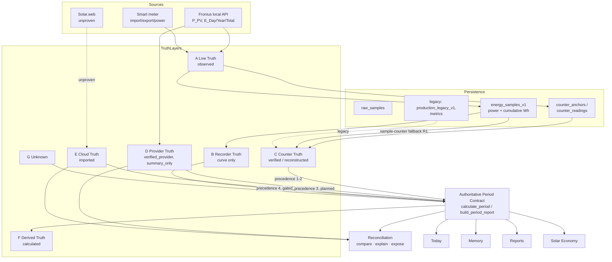

# EnergyRadar — Data Truth Architecture

> **Governing principle**
> EnergyRadar does **not** invent truth. It **identifies, reconciles and explains** truth.
>
> A displayed value is never an anonymous number. It always knows *what kind of
> truth it is*, *how confident we are*, *how fresh it is*, and *what it does not
> cover*.

Status: **authoritative architecture document.** Supersedes ad-hoc source
decisions. Companions: `FRONIUS_DATA_SOURCE_AUDIT.md` (evidence),
`MEMORY_INTEGRITY_CONTRACT.md` (Memory/period rules). Branch:
`feature/fronius-history-memory-integrity`.

This document defines the model EnergyRadar builds on for years. It is design
only — no UI redesign, no speculative provider implementation.

---

## 0. Why this exists

The audit proved the product's problem was never "no data":

- Real historical data exists locally (`energy_samples_v1` 140, `production_legacy_v1`
  765, `metrics` 3080) while the authoritative period path read empty anchor tables.
- Fronius exposes real cumulative values (`E_Day`/`E_Year`/`E_Total`) that were
  consumed only by the live projection, never by history.
- Different views consumed different truth sources, so they disagreed.
- Empty states usually meant *wrong query*, not *no data*.

The fix is not more bug-patching. It is a single, explicit truth model that every
value in the product obeys.

---

## 1. Truth layers

Every displayed value belongs to **exactly one** truth layer. Layers are ordered
by their role, not by preference (precedence is §3).

| Layer | Name | Definition | Backing source (today) | Historical? | May become a factual kWh total? |
|-------|------|-----------|------------------------|-------------|-------------------------------|
| **A** | **Live Truth** | Current instantaneous measurement | runtime projection (`services/projection.py`, Fronius `P_PV`, meter power) | no | **never** (power ≠ energy) |
| **B** | **Recorder Truth** | Persisted local samples (shape) | `energy_samples_v1` power columns | yes (with gaps) | **never** — curve/coverage only |
| **C** | **Counter Truth** | Persisted cumulative counters | `counter_anchors`/`counter_readings` (preferred); `energy_samples_v1.*_total_wh` / `pv_energy_today_wh` (reconstructed) | yes | **yes — authoritative** |
| **D** | **Provider Truth** | Verified summaries supplied by the device | Fronius `E_Day`, `E_Year`, `E_Total` | summary only | **as a summary**, never a fabricated curve |
| **E** | **Cloud Truth** | Solar.web / future cloud series | *none yet — unproven* | yes | only if access proven; always attributed |
| **F** | **Derived Truth** | Values EnergyRadar computes from A–E | `history.derive_*`, `periods` balances, `services/economy.py` | inherits | **never presented as measured** |
| **G** | **Unknown** | Genuinely unavailable | — | — | — |

**Hard laws**

1. **B never becomes C.** Power samples describe shape; integrating them into a
   factual kWh is forbidden (`periods.py` docstring, enforced by tests).
2. **D is not local history.** A provider summary is a known number for a summary
   period, not a curve and not a per-interval series.
3. **E must always be distinguishable from A–D.** Cloud data is never silently
   merged with local data.
4. **F never pretends to be measured.** Derived values carry `confidence: calculated`.
5. **G is real unknown** — never "not currently queried" and never "wrong table".

---

## 2. Metric metadata model

No anonymous numbers. Every metric is an **envelope**, not a scalar. This
formalises the shape already emitted by `periods.calculate_period` /
`viewmodels.build_period_report`.

```jsonc
{
  "value": 41.353,              // null when unknown
  "unit": "kWh",
  "truth_layer": "counter",     // A..G, see §1
  "source": "stored_sample_counter_delta",  // concrete producer
  "confidence": "reconstructed",// see confidence model below
  "coverage": "partial",        // complete | partial | summary_only | curve_only | gap | unavailable
  "freshness": "historical",    // live | recent | stale | historical | no_session
  "period_key": "sample:...|sample:...",  // identity of the evidence window
  "provenance": "stored_sample_counters", // human-traceable origin
  "reason": null,               // machine reason when value is null
  "no_extrapolation": true      // guarantee: no unobserved interval was filled
}
```

**Confidence model**

| Confidence | Meaning | Emitted by |
|-----------|---------|-----------|
| `verified` | Device counter delta between synchronized anchors | Counter Truth (anchors) |
| `verified_provider` | Exact provider summary (`E_Day` etc.), summary period only | Provider Truth |
| `reconstructed` | Exact delta of stored cumulative registers, coverage unproven | Counter Truth (sample counters) |
| `observed` | Live instantaneous reading | Live Truth |
| `calculated` | Derived from other truths (balance, tariff) | Derived Truth |
| `imported` | Retrieved from a cloud provider, attributed | Cloud Truth |
| `unknown` | No authoritative source supplied it | Unknown |

The confidence ladder is **not** a licence to upgrade a value: a `reconstructed`
number never becomes `verified` by being displayed prominently.

---

## 3. Source precedence

For a **period energy total**, resolve in this order and **stop at the first that
qualifies** (higher layers preferred; never mixed within one metric):

1. **Counter Truth — anchors** (`verified`)
2. **Counter Truth — stored sample counters** (`reconstructed`) *(shipped: R1)*
3. **Provider Truth — device summary** (`verified_provider`, `summary_only`) *(planned: §7 phase 2)*
4. **Cloud Truth — Solar.web** (`imported`) *(only if access proven)*
5. **Unknown** (`unknown`)

**Never** used as an energy fallback: Live Truth (A) or Recorder Truth (B) power
integration.

For **curve/shape**: Recorder Truth (B) is authoritative; Cloud Truth (E) may
supply a curve only when proven and is attributed separately.

For **live instantaneous**: Live Truth (A) only.

Precedence is per-metric and per-register. A period can legitimately be
`grid_import = verified`, `pv_generation = reconstructed`,
`house_consumption = unknown` simultaneously — and must say so.

---

## 4. One authoritative period contract

Today, Memory, Reports and Solar Economy **must** consume the same period object.
No view-specific truth, no duplicate calculation.

Single producer: **`periods.calculate_period` → `viewmodels.build_period_report`**
(shipped). The canonical object:

```jsonc
{
  "requested_period": { "from": "...Z", "to": "...Z" },
  "resolved_period":  { "from": "...Z", "to": "...Z", "state": "partial" },
  "timezone": "Europe/Berlin",
  "metrics": {
    "pv_generation":  { /* §2 envelope */ },
    "grid_import":    { /* ... */ },
    "grid_export":    { /* ... */ },
    "house_consumption": { /* derived */ },
    "direct_self_consumption": { /* derived */ }
  },
  "curve_ref": null,            // Recorder Truth series (today only, for now)
  "coverage":  { "pv": 0.0, "grid": 0.0, "home": 0.0 },
  "gaps": [ /* recording_gaps within bounds */ ],
  "provenance": "stored_sample_counters",  // dominant source of this period
  "freshness": { "state": "...", "last_anchor_at": null, "age_seconds": null },
  "reconciliation": null,       // §5, when ≥2 authoritative sources present
  "first_record": "...", "last_record": "...", "baseline": "...",
  "provider_summaries": null,   // §7 phase 2
  "has_records": true, "has_summary": true,
  "diagnostics": { /* raw enums, never on primary UI */ }
}
```

Rules: raw internal enum names live in `diagnostics`, never on the primary
surface. Backward compatibility is deliberate and test-guarded. Today ==
Memory == Report for identical bounds (asserted by
`test_memory_and_report_agree_for_identical_period`).

---

## 5. Reconciliation

When two **authoritative** sources cover the same metric+period (e.g. Counter
Truth anchor delta vs Provider Truth `E_Day`), EnergyRadar **compares, explains
and exposes** — it never overwrites and never silently chooses.

```
reconcile(primary, secondary):
    deviation_abs = |primary.value - secondary.value|
    deviation_rel = deviation_abs / max(primary.value, ε)
    class =
        aligned            if deviation_rel <= T_aligned
        minor_deviation    if deviation_rel <= T_minor
        material_deviation if deviation_rel <= T_material
        source_conflict    otherwise
    retain BOTH values, both timestamps, both provenances, both confidences
    primary stays the displayed value; secondary + class are exposed
```

Thresholds `T_aligned / T_minor / T_material` are **not invented here** — they are
defined explicitly with tests in a later phase (§7). Reconciliation classes:
`aligned`, `minor_deviation`, `material_deviation`, `local_incomplete`,
`provider_stale`, `source_conflict`, `incomparable_period`, `unavailable`.

Canonical reconciliation pairs: Anchor vs Fronius summary; Provider vs Cloud;
Local vs Imported.

---

## 6. Product language

Each state gets its own wording. "Keine Messwerte" is reserved for §1-G only.

| Real state | Never say | Say (semantics) |
|-----------|-----------|-----------------|
| Curve missing, totals known | "Keine Daten" | "Tagesertrag bekannt, Verlauf unvollständig" |
| Provider summary only | "Keine Daten" | "Vom Wechselrichter bekannt (Summe)" |
| Partial history | "Keine Daten" | "Teilweise aufgezeichnet" |
| Records exist, no reliable total | "Keine Daten" | "Messwerte vorhanden, keine belastbare Summe" |
| Reconstructed (sample counters) | "Verifiziert" | "Gespeicherte Zählerstände (eingeschränkte Genauigkeit)" |
| Live fresh, session just started | "Letzte Messung vor 2 Stunden" | "Aufzeichnung läuft · erste Speicherung läuft" |
| Genuinely nothing | — | "Keine gespeicherten Messwerte vorhanden" |

Wording is driven by the metric envelope (`coverage`/`confidence`/`freshness`),
never hand-authored per view. `lib/periodView.ts::provenanceLabel` +
`classifyPeriod` are the reference implementation.

---

## 7. Migration plan

| Phase | Scope | Status |
|-------|-------|--------|
| **0** | Freshness two-clock; R1 sample-counter fallback; R2 Memory on one contract | **Done** (`bbeab3a`, `2fa114a`) |
| **1** | Promote the §2 envelope to a typed vocabulary (`truth_layer`, `confidence`, `coverage`, `freshness` constants shared py↔ts); add `truth_layer` to emitted metrics | Next |
| **2** | Persist & surface **Provider Truth** (`E_Day`/`E_Year`/`E_Total`) in the period object as `summary_only`, never as a curve | After 1 |
| **3** | **Reconciliation layer** (§5) + explicit thresholds with tests | After 2 |
| **4** | Data hygiene: normalise mixed UTC/local columns; backfill `raw_samples.observed_at_utc`; document/retire legacy tables | Parallel |
| **5** | Per-range **curve series** for historical ranges (Recorder Truth over arbitrary bounds) | After 1 |
| **6** | **Cloud Truth** (Solar.web) behind proven access + reconciliation-only role | Gated on access |
| **7** | Extensions: battery, EV, dynamic tariffs (§9) | Future |

Each phase is independently shippable and test-gated. No phase fabricates data.

---

## 8. Breaking changes

- **Metric shape**: consumers must read the envelope (`source`/`confidence`/
  `coverage`/`freshness`), not a bare number. Anonymous numbers are removed from
  new surfaces.
- **`recording_since` semantics** changed from "newest live run start" to
  "earliest persisted record"; a new `current_session_since` carries the run start.
- **Empty-state contract**: "keine Messwerte" is now a §1-G-only string; views
  must branch on `has_records`/`has_summary`/curve presence.
- **Raw enum exposure**: internal enums move to `diagnostics`; any UI reading them
  directly must migrate to the labelled envelope.

All are deliberate and covered by tests; none silently change a displayed value's
truth.

---

## 9. Technical debt

**Removed**
- View-specific truth (MemoryView today-only stub) → one authoritative contract.
- Anchor-only dead-end for all historical periods → Counter-Truth reconstruction.
- Freshness conflation (persisted vs live) → two explicit clocks.
- Generic "no data" collapse → distinct, sourced states.

**Remaining (tracked for §7)**
- Mixed UTC/local storage in `energy_samples_v1` (`measured_at` UTC vs
  `pv_measured_at` local).
- `raw_samples.observed_at_utc` NULL for all legacy-backfilled rows.
- Overlapping legacy stores (`production_legacy_v1`, `metrics`, `production`,
  `snapshots`, `source_state`) need defined roles or retirement.
- Provider summaries (`E_Day` etc.) not yet persisted into the truth model.

---

## 10. Future roadmap

Each future integration slots into an existing truth layer — the model does not
change, only its inputs.

- **Solar.web → Cloud Truth (E).** Reconciliation partner for Counter/Provider
  truth; always attributed; never silently merged; only after access + licensing
  proven (see audit §3).
- **Battery.** Topology changes from `battery_free_single_pv`; house-consumption
  and self-consumption balances gain a storage term. New Counter Truth registers
  (charge/discharge); Derived Truth formulas updated, still `calculated`.
- **EV charging.** A load subcategory under house consumption (Derived Truth),
  optionally its own metered Counter Truth if a submeter exists.
- **Dynamic tariffs.** Time-varying tariff periods already modelled
  (`tariff_periods`); Solar Economy stays Derived Truth over the authoritative
  period object, with tariff resolution per interval.

---

## Appendix — Architecture diagram


